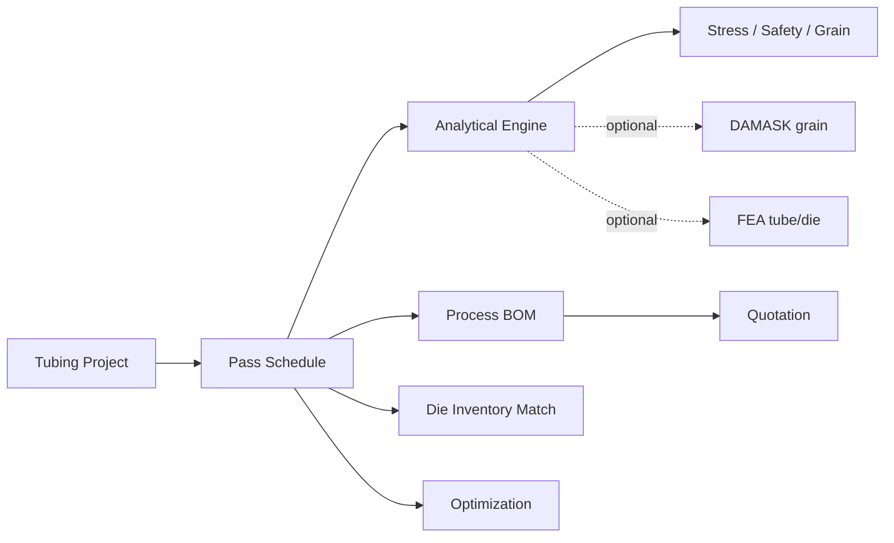

# Tubing Master — User Guide

Tubing Master is a desktop application for planning **tube drawing** jobs: from incoming and target tube geometry through multi-pass schedules, stress and safety checks, process documentation, and quotations.

This guide explains how the app is organized, what each part does, and where the product is headed.

---

## How the app fits together

A **project** is the central object. It stores:

- Incoming and target tube dimensions (OD / ID in mm)
- Drawing method (sink, rod, plug, etc.)
- Material model and properties
- Pass schedule (per-pass area reduction, semi-die angle, lubricant, heat treatment)
- Die inventory, BOM lines, and quotation settings

**Typical workflow**

1. Define geometry, material, and drawing method on **Tubing Project**.
2. Build or optimize passes on **Pass Schedule** or **Optimization**.
3. Run **Run Schedule / Refresh Plots** to update stress, safety factor, and grain-size estimates.
4. Review **Process BOM** and **Quotation** for manufacturing and pricing.
5. Match semi-die angles against **Die inventory**.
6. **Save to History** or export Excel files for shop use.

---

## Tabs and main features

### Tubing Project

Start here for every job.

| Area | Purpose |
|------|---------|
| **Incoming / Target tube** | Starting and final outer and inner diameters (mm). |
| **Drawing method** | Sink, rod, plug, etc. — affects mandrel/plug rows in the BOM. |
| **Material** | Presets (316L, copper, Nitinol, …) or custom properties via **Edit Material Property**. |
| **Cross-section strip** | Visual OD/ID progression pass by pass. |
| **Simulation backend** | **Analytical** (default) or **DAMASK** when installed (see below). |
| **Project history** | Save, open, and duplicate past projects. |

**Edit Material Property** opens a dialog for flow stress, UTS hardening, grain refinement, friction, density, and Nitinol transformation plateaus. You can **Import tensile test…** from a PDF or image: the app parses the report, detects diagram units (e.g. ksi vs MPa, % vs strain), fits a model, and shows a review table before applying values.

### Pass Schedule

The pass table is the manufacturing plan.

Each pass row includes:

- Output OD / ID after the pass
- Area reduction fraction
- Semi-die angle (α)
- Lubricant preset
- Mandrel / plug (when applicable)
- Interpass heat treatment (temperature, time, gas, equipment, notes)

You can edit cells directly, fit equal area-reduction steps to hit a target OD or ID, and snap semi-die angles to values in die inventory. Changes propagate to BOM, quotation, and plots when you refresh the schedule.

### Optimization

Uses [Optuna](https://optuna.org/) to search multi-pass schedules that meet your targets.

| Control | Meaning |
|---------|---------|
| Target total area reduction | Overall reduction from inlet to final tube |
| Pass count | Fixed or suggested from geometry and safety margin |
| Semi-die angle / friction | Fixed or varied per pass |
| Safety margin vs UTS | Minimum acceptable safety factor |

The preview table shows an optimized schedule you can apply to the Pass Schedule tab. Optimization uses the **analytical engine** (fast); FEA-based optimization lives on the FEA tab when dolfinx is available.

### FEA (optional)

Requires **FEniCSx / dolfinx** (conda-forge; not bundled in the desktop installer).

- **Single pass — tube / die model** — axisymmetric elastic FEA for one drawing step; schematic view of tooling.
- **FEA schedule optimization** — slower Optuna search scored by von Mises stress from FEA across the full pass chain.

Use this for verification or research setups. The packaged app ships without dolfinx; run from a conda environment for FEA work.

### Process BOM

Generates line items from the pass schedule and analytical metrics:

- Per-pass die and tooling rows
- Pulling stress, safety factor vs UTS, estimated grain size
- Nitinol-specific unloading / springback when applicable

Export to Excel for shop travelers or internal review.

### Die inventory

Maintain a library of semi-dies (angle α, OD range, stock status). The app can:

- Match schedule angles to inventory within a tolerance
- Flag unavailable or out-of-range dies
- Show schematic die views

### Quotation

Builds a customer quote from stock mass (from geometry and material density), pass count, and editable service lines (preprocessing, postprocessing, expedite, extras). Export to Excel.

---

## Core calculation logic (analytical engine)

The default backend is a **plane-stress analytical model** derived from tube-drawing theory. For each pass it computes:

1. **True strain** from area reduction: ε = ln(1 / (1 − r))
2. **Flow stress** from the material model (power-law hardening, or Nitinol superelastic plateaus)
3. **Pulling stress** — combines strain, die angle, and friction
4. **Safety factor** — UTS (strain-hardened) divided by pulling stress; values below 1.0 indicate overload risk
5. **Grain size (analytical)** — refinement law from accumulated plastic strain, with a material-specific floor

Geometry advances pass by pass: annulus area shrinks according to each step’s area reduction, updating OD and ID along the schedule.

**Nitinol** uses a separate superelastic model: loading/unloading plateaus (σ_ms, σ_mf, σ_as, σ_af), transformation strain, springback, and permanent set. Tensile import for Nitinol expects a full loading–unloading cycle in the test report.

---

## Optional simulation backends

| Backend | Role today | Install |
|---------|------------|---------|
| **Analytical** | Always available; stress, safety, analytical grain | Built in |
| **DAMASK** | Crystal-plasticity grain evolution per pass when `DAMASK_grid` is on PATH | [requirements-damask.txt](../requirements-damask.txt), external DAMASK build |
| **dolfinx FEA** | Single-pass and schedule FEA in dev/conda environments | conda-forge `dolfinx` |

When DAMASK is selected but unavailable or a run fails, the app **falls back to analytical grain** and notes that in the summary.

---

## Data and exports

- **Projects** are saved as JSON bundles under the user Projects folder (see [PACKAGING.md](PACKAGING.md) for frozen-app paths).
- **Excel export** — pass BOM, process document, and quotation worksheets.
- **Tests** — `pytest tests/` covers engine, tensile import, app paths, and related logic.

---

## Development roadmap

The current release focuses on a reliable **analytical workflow** (schedule, optimization, BOM, quotation, die inventory) in a installable desktop app. The following areas are planned for deeper integration:

### DAMASK — grain size from crystal plasticity

**Goal:** Production-quality **grain size prediction** tied to each drawing pass using [DAMASK](https://damask-multiphysics.org/) polycrystal simulations.

| Phase | Direction |
|-------|-----------|
| **Near term** | Stabilize DAMASK grid runs from the UI; clearer status, progress, and error reporting |
| **Mid term** | Material templates per alloy; automatic strain-path input from the pass schedule |
| **Long term** | Batch schedule runs; compare DAMASK grain trajectory vs analytical law in BOM and plots; optional default backend for supported materials |

Today DAMASK coupling exists for development environments; the roadmap is to make it a first-class, documented path for grain-size engineering—not only a fallback-aware experiment.

### FEA — pass simulation and schedule optimization

**Goal:** **Finite element analysis** for tube-in-die drawing to validate and optimize passes beyond analytical estimates.

| Phase | Direction |
|-------|-----------|
| **Near term** | Robust axisymmetric tube/die model per pass; clear comparison of FEA von Mises vs analytical pulling stress |
| **Mid term** | Full **multi-pass FEA simulation** (chained geometry, contact, friction models) from the Pass Schedule tab |
| **Long term** | **FEA-driven optimization** — Optuna (or similar) minimizing peak stress, die load, or springback using FEA objectives; hybrid rank-reconcile with analytical pre-screening |

The FEA tab and `fea_optimize` module are early steps; the packaged installer will remain analytical-only until FEA dependencies can be distributed or run via a connected compute service.

### Other directions (under consideration)

- Windows installer parity and CI-built artifacts
- Richer lubrication and temperature models in the analytical engine
- Project templates and shop-specific material libraries
- Report PDF export (schedule + BOM + quotation in one document)

---

## Getting help

- **Run from source:** [README.md](../README.md)
- **Build installers:** [PACKAGING.md](PACKAGING.md)
- **Issues and contributions:** [GitHub repository](https://github.com/Matanley/Tubing-Master)

For analytical results, always validate critical schedules with shop experience and, when available, FEA or physical trials.
